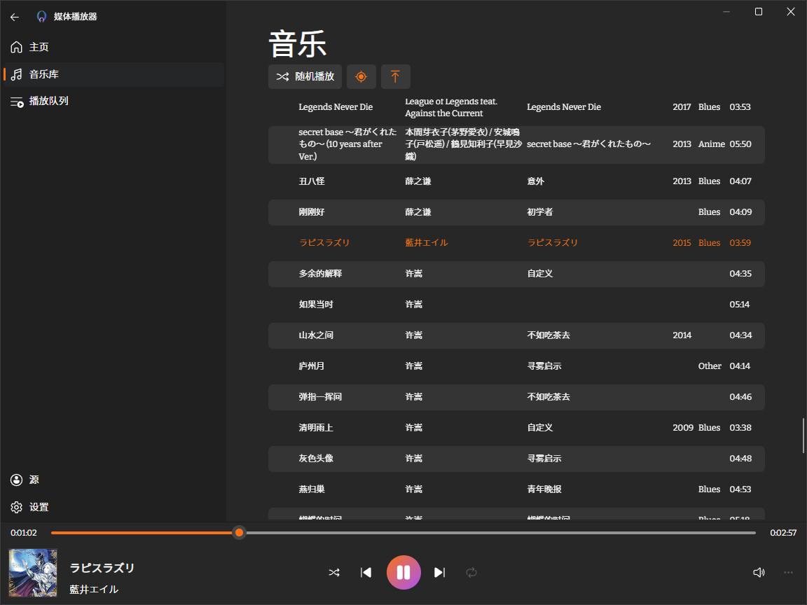

# QSync



## Roadmap
### Common

- [x] User Management
   - token auth
- [x] Websocket Message
- [] Add client id (Each websocket connection has a unique client id)

### MuSync
- [x] Music Player
- [x] Local Music Library
- [x] Unified Track ID
- [x] Sync Player
- [] [Media Session API](https://developer.mozilla.org/en-US/docs/Web/API/MediaSession)
- [] Remote Music Library
   - Netease
   - QQ Music
   - Bilibili
   - Migu
   - Youtube
- [] Lyric
- [] Download metadata

## FIXME
- [] Need to consider loading time, pause local player when loading. (Preload?)

## Tech Stack

- Server
   - axum: http & websocket
   - tonic: grpc
   - sea-orm: orm
   - sqlite: database
- Frontend
   - Vite
   - Vue
   - Typescript
   - TailwindCSS

## Build

- Create `src-tauri/.env` file and add env variables
   ```env
   DATABASE_URL=sqlite://./target/db.sqlite3
   JWT_SECRET=JJJWWW
   ```

- Generate typescript protobuf client, if you change the proto files in `protos/`. Rust grpc server code will audo generated when building.
   ```bash
   # windows
   protoc --plugin=protoc-gen-ts_proto=".\\node_modules\\.bin\\protoc-gen-ts_proto.cmd" --ts_proto_out=./src/generated --ts_proto_opt=esModuleInterop=true --ts_proto_opt=outputClientImpl=grpc-web ./protos/musync.proto
   # others
   protoc --plugin=./node_modules/.bin/protoc-gen-ts_proto --ts_proto_out=./src/generated --ts_proto_opt=esModuleInterop=true --ts_proto_opt=outputClientImpl=grpc-web ./protos/musync.proto
   ```

## Run

Server will run on `localhost:8396`;

### Server
```
cd src-tauri/server/
cargo run --example server
```

### Web
```
pnpm dev
```
